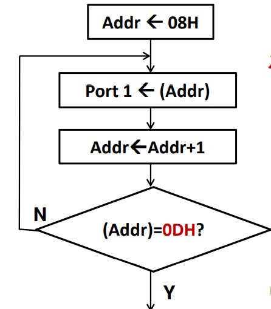
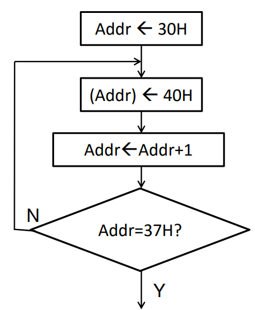
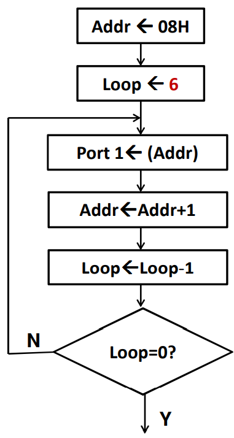
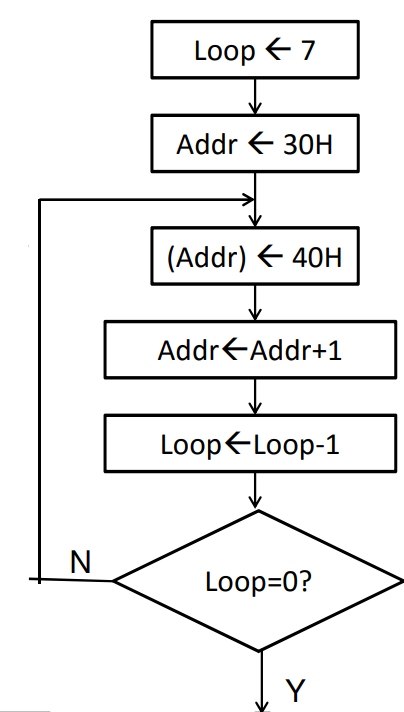
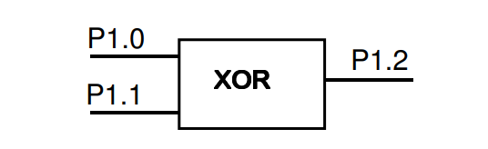
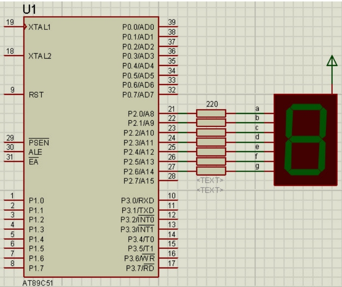
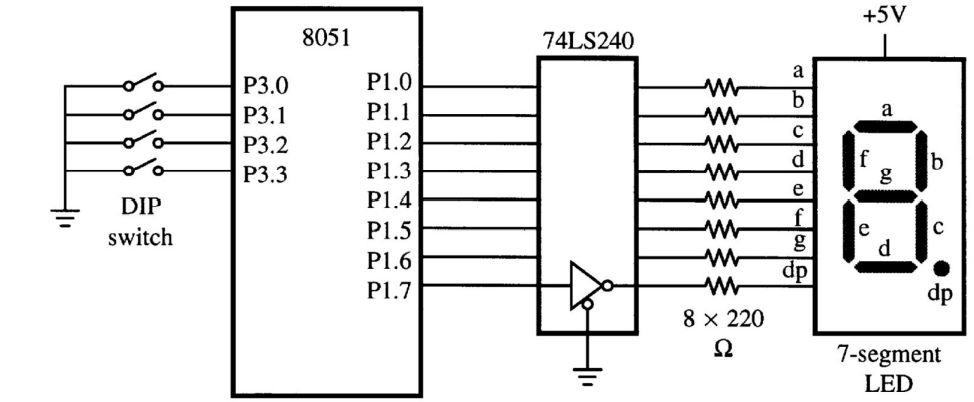

# The 8051 Microcontroller
## Instruction Set
### Trần Minh Nhật (HCM City University of Technology)

1. Examine the content of A, if 5 ≤ A ≤ 10 then output A to Port 1; 
if not, output A to Port 2

```
       ORG 0
       CJNE A, #5, $+3
       JC PORT2
       CJNE A, #11, $+3
       JNC PORT2
       MOV P1, A
       SJMP DONE 
PORT2: MOV A, P2
DONE:  NOP
       END
```

2. Assume that a line of ASCII codes is in internal memory
beginning at address 08H. This line is terminated with a
carriage return code (0DH). Write a program that sends this
string to Port 1.


```
    ORG 0
    MOV R0, #08H
LOOP: 
    MOV P1, @R0
    INC R0
    CJNE @R0, #0DH, LOOP
    END
```

3. Write a program to write 40H to internal RAM from location 
30H to location 36H.



```
    ORG 0
    MOV R0, #30H
LOOP: 
    MOV @R0, #40H
    INC R0
    CJNE R0, #37H, LOOP
    END
```

4. Assume that a string of ASCII codes is
in internal memory beginning from
address 08H to 0DH. Write a program
that sends this string to Port 1.
 
 

 ```
    ORG 0
    MOV R0, #08H
    MOV R7, #6
LOOP:
    MOV P1, @R0
    INC R0
    DJNZ R7, LOOP
    END
 ```

 5. Write a program to write 40H to internal 
RAM from location 30H to location 36H.



```
    ORG 0000H
    MOV R7, #7
    MOV R0, #30H
LOOP:
    MOV @R0, #40H
    INC R0
    DJNZ R7, LOOP
    END
```

6. Write a program to clear ACC, then add 3 to the 
accumulator ten times.

```
    ORG 0
    CLR A
    MOV R7, #10
LOOP:   
    ADD A, #3
    DJNZ R7, LOOP
    END
```

7. Write a program to copy a block of 10 bytes from RAM 
location starting at 37h to RAM location starting at 59h.

```
    ORG 0000H
    MOV R7, #10     ;COUNTER
    MOV R0, #37H    ;SOURCE POINTER
    MOV R1, #59H    ;DEST POINTER
LOOP:
    MOV A, @R0
    MOV @R1, A
    INC R1
    INC R0
    DJNZ R7, LOOP
    END
```

8. Given a 20-byte string in **internal** RAM, starting at address 40H. 
Write a program that output **even** numbers to Port 2.

```
    ORG 0000H
    MOV R7, #20
    MOV R0, #40H
LOOP:
    MOV A, @R0
    RRC A
    JC ODD_NUM
    MOV P2, @R0
ODD_NUM:
    INC R0
    DJNZ R7, LOOP
    END
```

9. Given a 20-byte string in **external** RAM, starting at address 
4000H. Write a program that output **odd** numbers to Port 2

```
    ORG 0000H
    MOV R7, #20
    MOV DPTR, #4000H
LOOP:
    MOVX A, @DPTR
    JNB ACC.0, EVEN_NUM
    MOV P2, A
EVEN_NUM:
    INC DPTR
    DJNZ R7, LOOP
    END
```

10. Given a 20-byte string in internal RAM, starting at address 40H. 
Write a program that output even numbers to Port 2 and odd 
numbers to Port 1

```
    ORG 0000H
    MOV R0, #40H
    MOV R7, #20
LOOP:
    MOV A, @R0
    JNB ACC.0, EVEN_NUM
    MOV P1, @R0
    SJMP NEXT
EVEN_NUM:
    MOV P2, @R0
NEXT: INC R0
    DJNZ R7, LOOP
    END
```

11. Given a 100-byte signed number string in external RAM at address 
starting from 0100H. Write a program that sends positive numbers 
to Port 1 and negative numbers to Port 2.

**HINT** :
- A positive number has MSB = 0.
- A negative number has MSB = 1.
- Use JB/JNB instruction
```
    ORG 0000H
    MOV R7, #100
    MOV DPTR, #0100H
LOOP:
    MOVX A, @DPTR
    JB ACC.7 NEGATIVE
    MOV P1, A
    SJMP NEXT
NEGATIVE:
    MOV P2, A
NEXT:
    INC DPTR
    DJNZ R7, LOOP
    END
```
12. 

```
LOOP:
    MOV C, P1.0
    JNB P1.1, SKIP 
    CPL C
SKIP:
    MOV P1.2, C
    SJMP LOOP
```

13. Given a packed-BCD number in location 33H of internal RAM. Write
a program that calculate the square of high decade of this number,
and store the result in internal RAM at address 34H

```
    ORG 0000H
    MOV A, 33H
    SWAP A
    ANL A, #0FH
    MOV DPTR, #TABLE
    MOVC A, @A+DPTR
    MOV 34H, A
TABLE:
    DB 0, 1, 4, 9, 16, 25, 36, 49, 64, 81
    END
```

14. Given a packed-BCD number in location 34H of internal RAM. Write
a program that displays the low decade of this number on the
common-anode 7-seg LED connected to Port 2 (schematic).



|  | D7| D6| D5 | D4 | D3 | D2 | D1 | D0 | |
|:---:|:---:|:---:|:---:|:---:|:---:|:---:|:---:|:---:|:---:|
|0 | 0 | 1 | 0 | 0 | 0 | 0 | 0 | 0 | 40H |
|1 | 0 | 1 | 1 | 1 | 1 | 0 | 0 | 1 | 79H |
|2 | 0 | 0 | 1 | 0 | 0 | 1 | 0 | 0 | 24H |
|3 | 0 | 0 | 1 | 1 | 0 | 0 | 0 | 0 | 30H |
|4 | 0 | 0 | 0 | 1 | 1 | 0 | 0 | 1 | 19H |
|5 | 0 | 0 | 0 | 1 | 0 | 0 | 1 | 0 | 12H |
|6 | 0 | 0 | 0 | 0 | 0 | 0 | 1 | 0 | 02H |
|7 | 0 | 1 | 1 | 1 | 1 | 0 | 0 | 0 | 78H |
|8 | 0 | 0 | 0 | 0 | 0 | 0 | 0 | 0 | 00H |
|9 | 0 | 0 | 0 | 1 | 0 | 0 | 0 | 0 | 10H |

```
    ORG 0000H
    MOV 34H, #25H   ;CHANGEBLE
    MOV A, 34H
    ANL A, #0FH
    MOV DPTR, #TABLE
    MOVC A, @A+DPTR
    MOV P2, A
    SJMP DONE
TABLE: 
    DB 40H, 79H, 24H, 30H, 19H
    DB 12H, 02H, 78H, 00H, 10H
DONE:
    NOP 
    END
```

15. A 4-bit DIP switch and a common-anode 7-segment LED are 
connected to an 8051 as shown in the following figure. Write a 
program that continually reads a 4-bit code from the DIP switch and 
updates the LEDs to display the appropriate hexadecimal character. 
For example, if the code 1100B is read, the hexadecimal character 
“C” should appear, thus, segments a through g respectively should 
be ON, OFF, OFF, ON, ON, ON, and OFF. Note that setting an 8051 
port pin to “1” turns the corresponding segment “ON”.



|  | DP| G| F | E | D | C | B | A | |
|:---:|:---:|:---:|:---:|:---:|:---:|:---:|:---:|:---:|:---:|
|0 | 0 | 0 | 1 | 1 | 1 | 1 | 1 | 1 | 3FH |
|1 | 0 | 0 | 0 | 0 | 0 | 1 | 1 | 0 | 06H |
|2 | 0 | 1 | 0 | 1 | 1 | 0 | 1 | 1 | 5BH |
|3 | 0 | 1 | 0 | 0 | 1 | 1 | 1 | 1 | 4FH |
|4 | 0 | 1 | 1 | 0 | 0 | 1 | 1 | 0 | 66H |
|5 | 0 | 1 | 1 | 0 | 1 | 1 | 0 | 1 | 6DH |
|6 | 0 | 1 | 1 | 1 | 1 | 1 | 0 | 1 | 7DH |
|7 | 0 | 0 | 0 | 0 | 0 | 1 | 1 | 1 | 07H |
|8 | 0 | 1 | 1 | 1 | 1 | 1 | 1 | 1 | 7FH |
|9 | 0 | 1 | 1 | 0 | 1 | 1 | 1 | 1 | 6FH |
|A | 0 | 1 | 1 | 1 | 0 | 1 | 1 | 1 | 77H |
|B | 0 | 1 | 1 | 1 | 1 | 1 | 0 | 0 | 7CH |
|C | 0 | 0 | 1 | 1 | 1 | 0 | 0 | 1 | 39H |
|D | 0 | 1 | 0 | 1 | 1 | 1 | 1 | 0 | 5EH |
|E | 0 | 1 | 1 | 1 | 1 | 0 | 0 | 1 | 79H |
|F | 0 | 1 | 1 | 1 | 0 | 0 | 0 | 1 | 71H |

```
    ORG 0000H
    MOV P1, #0
    MOV A, P3
    ANL A, #0FH
    MOV DPTR, #TABLE
    MOVC A, @A+DPTR
    MOV P1, A
TABLE:
    DB 3FH, 06H, 5BH, 4FH, 66H, 6DH, 7DH, 07H
    DB 7FH, 77H, 7CH, 39H, 5EH, 79H, 71H
    END
```

15. Assume that there are 2 switches connected to P1.0 and 
P1.1 (active low). Write a program to get the status of these 
switches every 1 minute and calculates as follow.

| P1.1 | P1.0  | CALCULATION |
|:---:|:---:|:---:|
| 0   |  0  |Rotate right 1 bit Port 2|
| 0   |  1  |Rotate left 1 bit Port 2 |
| 1   |  0  |Complement Port 2        |
| 1   |  1  |Swap Port 2              |

```
    ORG 0000H
    MOV DPTR, #JMP_TABLE
LOOP:
    MOV A, P1
    ANL A, #03H
    RL A
    JMP @A+DPTR
JMP_TABLE:
    AJMP CASE0
    AJMP CASE1
    AJMP CASE2
    AJMP CASE3
CASE0:
    MOV A, P2
    RR A
    SJMP CONT
CASE1:
    MOV A, P2
    RL A
    SJMP CONT
CASE2:
    MOV A, P2
    CPL A
    SJMP CONT
CASE3:
    MOV A, P2
    SWAP A
CONT:
    MOV P2, A
    ACALL DELAY1M
    SJMP LOOP
DELAY1M:
    MOV R4, #2
LP3:MOV R5, #240
LP2:MOV R6, #250
LP1:MOV R7, #250
    DJNZ R7, $
    DJNZ R6, LP1
    DJNZ R5, LP2
    DJNZ R4, LP3
    RET
    END
```

16. Assume that there are 4 switches connected to P1.0, P1.1,
P1.2, P1.3 (active low) and 1 LED connected to P1.7
(active low). Write a program to get the status of these
switches and calculates as follow.

| P1.1 | P1.0  | CALCULATION |
|:---:|:---:|:---:|
| 0   |  0  |F=NOT(Y)|
| 0   |  1  |F= X AND Y |
| 1   |  0  |F = X OR Y|
| 1   |  1  |F= X XOR Y|

**Note** X and Y are data from P1.2 and P1.3, respectively; Output F to P1.7
```
    ORG 0000H
    MOV DPTR, #JMP_TABLE
LOOP:    
    MOV A, P1
    ANL A, #0FH
    RL A
    JMP @A+DPTR
JMP_TABLE:
    AJMP CASE_0
    AJMP CASE_1
    AJMP CASE_2
    AJMP CASE_3
CASE_0:
    MOV C, P1.3
    CPL C
    SJMP CONT
CASE_1:
    MOV C, P1.3
    ANL C, P1.2
    SJMP CONT
CASE_2:
    MOV C, P1.3
    ORL C, P1.2
    SJMP CONT
CASE_3:
    MOV C, P1.3
    JC  P1.2, COMPLEMENT
    SJMP CONT
COMPLEMENT:
    CPL C
CONT:
    MOV P1.7, C
    SJMP LOOP
    END


```


